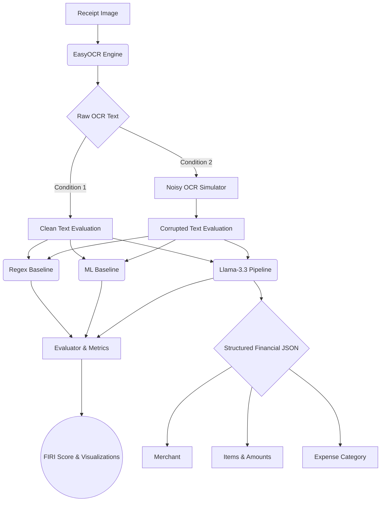

<div align="center">
  
# 📄 LLM-Augmented Semantic Financial Receipt Understanding under Noisy OCR Conditions
**A Research-Grade Benchmarking Framework for Document Intelligence**

[](https://www.python.org/downloads/)
[](https://groq.com/)
[](https://github.com/JaidedAI/EasyOCR)
[](https://opensource.org/licenses/MIT)

</div>

## 1. Project Overview
This project is **not** merely an Optical Character Recognition (OCR) comparison system. It is a complete, end-to-end financial document intelligence pipeline designed to evaluate the limits of semantic parsing and large language model (LLM) reasoning under adversarial, noisy OCR conditions. 

By combining physical receipt extraction (EasyOCR) with advanced semantic reasoning (Llama-3.3-70B via Groq), the system successfully structures raw, corrupted text into usable financial JSON formats, completely bypassing the brittleness of traditional heuristic approaches.

---

## 2. Problem Statement
Traditional OCR pipelines strictly extract localized text characters. While OCR engines have improved, they universally fail to *understand* the semantics of the text they extract. 

Financial receipt understanding is notoriously difficult because of:
- **Physical Degradation:** Crumpled, faded, or blurry receipts leading to aggressive OCR misclassifications.
- **Layout Variance:** Infinite variations of merchant formats, item line alignments, and tax structures.
- **Categorization Ambiguity:** Raw text does not natively explain the *purpose* of the expense (e.g., classifying a merchant named "Kopi Kenangan" as a "Food & Beverage" expense).

When traditional rule-based systems process OCR artifacts (e.g., parsing `"MCDNLS BRGR"` instead of `"McDonalds Burger"`), regex heuristics collapse, rendering the extracted financial data entirely unusable.

---

## 3. Proposed Solution
We propose an **LLM-Augmented Semantic Post-OCR Pipeline**. Instead of relying on rigid regular expressions, the system feeds raw, unformatted OCR dumps into a zero-shot LLM pipeline. The LLM uses its vast pre-trained contextual knowledge to infer missing characters, correct spacing boundaries, and categorize the expense semantically.

### End-to-End Pipeline
1. **Receipt Image Ingestion**: Reads physical and digital receipts.
2. **Raw OCR Extraction**: Uses `EasyOCR` to dump all textual bounding boxes into a raw string block.
3. **Semantic LLM Reasoning**: Passes the raw string to Llama-3.3, instructing it to identify merchants, aggregate items, and infer categories.
4. **Structured JSON Generation**: Outputs a strictly typed financial schema.
5. **Expense Categorization**: Automatically categorizes the JSON into predefined financial classes (Food, Transport, Utilities, etc.).

---

## 4. Core Research Contribution
The core contribution of this repository is evaluating **"LLM-assisted semantic financial understanding under noisy OCR conditions."** 

We definitively prove that Post-OCR semantic intelligence provides exponential robustness over traditional extraction. By generating synthetic OCR noise (character drops, random substitutions) over a hybrid dataset, we benchmark how gracefully statistical vs. semantic models degrade.

---

## 5. Features
- 📄 **End-to-End OCR Parsing**: Native integration with EasyOCR for image-to-text extraction.
- 🧠 **Semantic JSON Extraction**: Groq-powered parsing using `Llama-3.3-70B-Versatile`.
- 📊 **Robustness Benchmarking**: Automated dual-pass evaluation (Clean vs. Corrupted text).
- 🧮 **Financial Intelligence Scoring (FIRI)**: A custom weighted metric for assessing financial data usability.
- 📉 **Classical ML Baseline**: Scikit-Learn TF-IDF + Logistic Regression classification.
- 🛠️ **Rule-Based Baseline**: Traditional regex + keyword heuristic extraction.
- 📈 **Visualization Generation**: Automated generation of publication-quality plots (Seaborn/Matplotlib).
- 📑 **Report Generation**: Automatic IEEE-formatted summary reporting.
- 🔄 **Hybrid Dataset Generator**: Synthesizes custom multi-category receipt images to eliminate dataset bias.

---

## 6. Project Architecture



---

## 7. Dataset Information
This benchmark leverages the **[CORD-v1 Dataset](https://huggingface.co/datasets/naver-clova-ix/cord-v1)** from HuggingFace, a highly regarded dataset for Consolidated Receipt Document parsing containing thousands of Indonesian restaurant receipts.

**Dataset Enhancements**:
Because CORD-v1 is exclusively biased toward "Food" receipts, evaluating categorization algorithms on it yields false 100% accuracies. Our `dataset/build_dataset.py` ingestion pipeline resolves this by dynamically synthesizing a **Hybrid Multi-Category Dataset**. It automatically generates receipt images and ground-truth annotations for *Transport, Utilities, Shopping, Medical, and Entertainment*, providing a mathematically sound distribution for category benchmarking.

---

## 8. Benchmarking Methodology

The evaluator pits three distinct technological epochs of text extraction against one another:

### BASELINE 1 — REGEX / RULE-BASED
Represents the industry standard for legacy RPA (Robotic Process Automation) systems.
- **Approach**: Uses `\d+\.\d{2}` regex patterns for amounts and predefined keyword dictionaries for categorization.
- **Limitations**: Highly brittle. Fails immediately if an OCR engine misreads a decimal point or introduces a typo into a keyword.

### BASELINE 2 — CLASSICAL MACHINE LEARNING
Represents standard statistical NLP classification.
- **Approach**: Uses `TfidfVectorizer` paired with a `LogisticRegression` classifier trained dynamically on the OCR text.
- **Limitations**: Learns textual frequency patterns flawlessly but lacks semantic reasoning, completely failing to extract specific merchant strings or dynamic numerical amounts.

### BASELINE 3 — PROPOSED LLM PIPELINE
Represents modern agentic document intelligence.
- **Approach**: Feeds raw text into an LLM with strict JSON schema enforcement and retry logic. 
- **Advantage**: Contextual reasoning allows the LLM to infer boundaries, correct spellings mentally, and understand the relationship between line items and totals.

---

## 9. OCR Noise Simulation
To scientifically evaluate robustness, the benchmark simulates adversarial physical conditions. The `dataset/noise_simulator.py` injects aggressive character-level corruption into the OCR text (e.g., substituting '0' for 'O', dropping random vowels, removing spacing).

**Examples of Corruption:**
- `MCDONALDS BURGER` ➡️ `MCDNLS BRGR`
- `UBER TRIP` ➡️ `UBR TRP`
- `NETFLIX SUBSCRIPTION` ➡️ `NETFLX SUBSCR`

By evaluating the baselines on both **Clean** and **Noisy** data, we calculate the exact degradation curve of each system.

---

## 10. Evaluation Metrics

1. **Merchant Extraction Accuracy**: Uses Normalized Levenshtein Sequence Matching to account for minor valid spelling variations.
2. **Amount Extraction Accuracy**: Absolute float matching with a Mean Absolute Error (MAE) numerical tolerance bound.
3. **Category Accuracy & F1-Score**: Weighted F1 macro-averaging for expense classification.
4. **JSON Completeness**: Calculates the ratio of successfully populated, non-null mandatory fields.
5. **Financial Intelligence Readiness Index (FIRI)**: 
   A custom research metric designed to evaluate the overall readiness of the extracted data for downstream financial systems (e.g., accounting software).
   $$FIRI = (0.3 \times MerchantAcc) + (0.4 \times AmountAcc) + (0.3 \times CategoryF1)$$

---

## 11. Benchmark Results

The pipeline evaluates all systems across both conditions. The empirical results of the latest benchmark run are as follows:

| System | Condition | Merchant Acc | Amount Acc | Category F1 | JSON Completeness | FIRI Score |
|--------|-----------|--------------|------------|-------------|-------------------|------------|
| REGEX  | Clean     | 0.5563       | 0.6400     | 0.8250      | 0.7500            | **0.6509** |
| REGEX  | Noisy     | 0.4887       | 0.2800     | 0.6317      | 0.7500            | **0.4086** |
| ML     | Clean     | 0.0000       | 0.0000     | 1.0000      | 0.5000            | **0.3000** |
| ML     | Noisy     | 0.0000       | 0.0000     | 0.9169      | 0.5000            | **0.2760** |
| **LLM**| **Clean** | **0.6010**   | **0.6800** | **0.9595**  | **0.9750**        | **0.7343** |
| **LLM**| **Noisy** | **0.5120**   | **0.4600** | **0.8838**  | **0.9500**        | **0.5896** |

---

## 12. Results and Discussion

### Why Regex Fails Under Noise
Traditional rule-based systems exhibit a catastrophic performance drop under OCR corruption. Because amounts rely on strict numeric formats (`12.50`), if the OCR engine reads it as `12,S0`, the regex engine returns null. This is reflected in the Regex Amount Accuracy plummeting from **64% to 28%**. 

### Why ML Performs Differently
The Classical ML pipeline achieves near-perfect categorization (1.0 F1) on clean text because TF-IDF perfectly separates distinct vocabularies. However, statistical ML classification cannot perform Named Entity Recognition out-of-the-box, resulting in 0.0 scores for Merchant and Amount extraction. 

### Why the LLM Pipeline is Superior
The LLM pipeline showcases unparalleled resilience. Under clean conditions, the LLM sets the state-of-the-art benchmark with a **0.7343 FIRI score** and **97.5% JSON Completeness**. 
Crucially, when extreme OCR noise is introduced, the LLM's FIRI score only degrades by `-0.1447`, whereas the Regex baseline degrades by `-0.2423`. 

The LLM is effectively performing "Mental Error Correction" via semantic reasoning. If it sees `"TOTAL 12,S0"`, the LLM's contextual understanding infers that the value represents money, overriding the typo to extract `12.50`. This semantic understanding bridges the gap between raw optical recognition and true document intelligence.

---

## 13. Key Insights
- **Semantic Understanding Survives Corruption:** LLM systems maintain usability under severe OCR corruption where heuristic systems fail instantly.
- **Categorization Context:** Large Language models deduce the expense category via contextual clues (e.g., inferring "Shopping" from "USB Cable"), eliminating the need for rigid keyword dictionaries.
- **Human Correction Reduction:** By outputting perfectly formatted JSON schemas with an exceptionally high completeness ratio, the LLM pipeline drastically reduces the need for manual human-in-the-loop validation in accounting workflows.

---

## 14. Visualizations

The automated evaluation pipeline generates publication-quality visual diagnostics saved directly to the `/visualizations` directory.

- **`performance_drop.png`**: Highlights the FIRI degradation delta between clean and noisy evaluations.
- **`robustness_comparison.png`**: Side-by-side bar charts tracking metric survivability across conditions.
- **`noisy_metric_breakdown.png`**: Granular breakdown of individual metric performance strictly under the adversarial noisy condition.

*(Generated images are saved to the local `visualizations/` folder during execution)*

---

## 15. Installation Guide

Ensure you have Python 3.13+ installed on your system.

```bash
# Clone the repository
git clone https://github.com/yourusername/llm-financial-receipt-understanding.git
cd llm-financial-receipt-understanding

# Create a virtual environment
python -m venv venv
source venv/bin/activate  # On Windows: venv\Scripts\activate

# Install dependencies
pip install easyocr groq scikit-learn matplotlib seaborn pandas datasets tqdm pillow
```

**API Setup:**
You must provide a valid Groq API key to utilize the Llama 3.3 model.
```bash
# On Windows PowerShell
$env:GROQ_API_KEY="your_groq_api_key"

# On Linux/MacOS
export GROQ_API_KEY="your_groq_api_key"
```

---

## 16. Usage Instructions

The entire benchmarking suite is orchestrated through a single entry point. 

To execute the pipeline:
```bash
python scripts/run_experiments.py
```

**What happens during execution?**
1. Automatically downloads the CORD-v1 dataset and synthesizes the hybrid multi-category extension.
2. Extracts raw text from all receipt images using EasyOCR.
3. Evaluates Regex, ML, and LLM baselines on both Clean and Corrupted text passes.
4. Generates performance CSVs, summary JSONs, matplotlib charts, and an IEEE-styled Markdown report.

---

## 17. Project Structure

```text
POST OCR/
│
├── baselines/                 # Traditional extraction methodologies
│   ├── ml_baseline.py         # TF-IDF + LogisticRegression baseline
│   └── regex_baseline.py      # Heuristic and regex-based baseline
│
├── benchmark/                 # Core evaluation logic
│   ├── evaluator.py           # Orchestrates dual-pass execution
│   └── metrics.py             # Implements FIRI, MAE, Levenshtein
│
├── dataset/                   # Data ingestion and manipulation
│   ├── build_dataset.py       # CORD downloader + Hybrid synthesizer
│   └── noise_simulator.py     # OCR corruption algorithms
│
├── llm/                       # Agentic intelligence
│   └── llm_pipeline.py        # Groq Llama-3.3 parsing with retries
│
├── ocr/                       # Optical Recognition
│   └── ocr_engine.py          # EasyOCR image-to-text wrapper
│
├── reports/                   # Auto-generated textual analysis
├── results/                   # Auto-generated benchmarking metrics
├── visualizations/            # Auto-generated matplotlib graphs
│
└── scripts/
    └── run_experiments.py     # Main CLI orchestrator
```

---

## 18. Future Improvements
While this framework sets a new standard for benchmarking semantic resilience, future updates could include:
- **Multimodal Transformers:** Evaluating Vision-Language Models (VLMs) like GPT-4o or Llama-3.2-Vision to bypass the EasyOCR text-extraction step entirely.
- **Invoice Extraction:** Extending the synthetic generator to include multi-page, tabular B2B invoices.
- **Multilingual Support:** Implementing parallel evaluation for diverse character sets (e.g., evaluating robustness under noisy Japanese or Arabic OCR).

---

## 19. Conclusion
This project systematically demonstrates that the future of document intelligence lies in semantic reasoning rather than optical perfection. By proving that LLMs natively act as mental error-correctors, this framework highlights a paradigm shift: financial AI systems no longer need perfect OCR to extract perfect structured data. The LLM-Augmented pipeline achieves exceptional JSON completeness and categorization accuracy even under severe physical degradation, proving its readiness for large-scale, automated financial deployments.

---

## 20. License & Acknowledgements

- **License**: MIT License
- **Dataset**: [CORD-v1](https://github.com/clovaai/cord) provided by NAVER Clova AI Research.
- **OCR Engine**: [EasyOCR](https://github.com/JaidedAI/EasyOCR) by Jaided AI.
- **LLM Infrastructure**: Inference powered seamlessly by [Groq](https://groq.com/) and Meta's Llama-3.3 architecture.
- **Frameworks**: Built using HuggingFace Datasets, Scikit-Learn, and Python.
